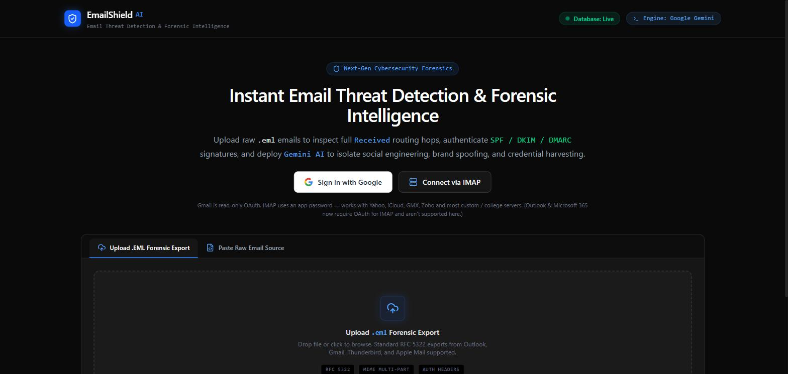
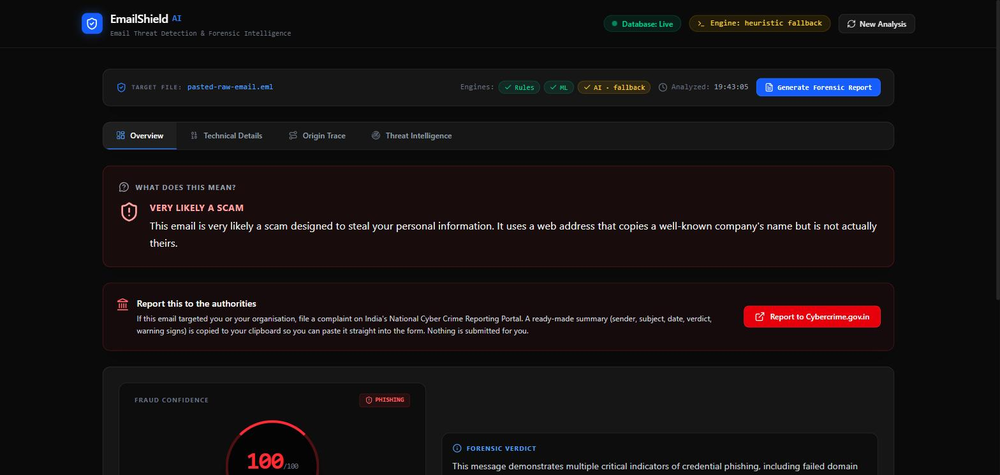
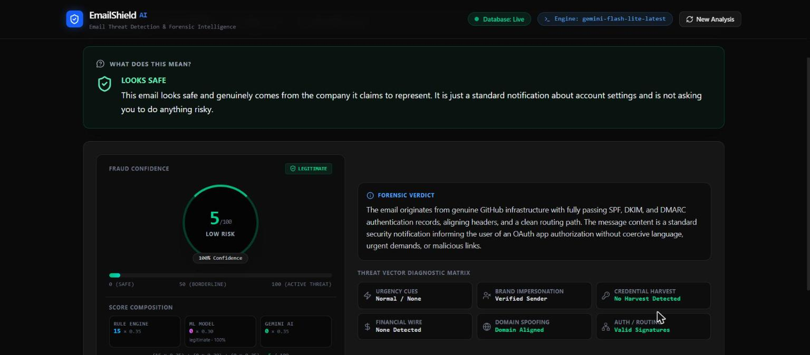
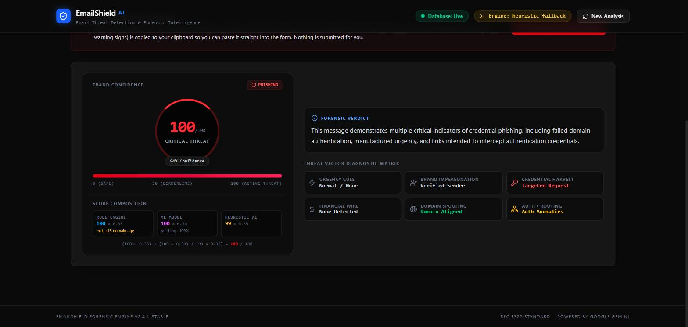
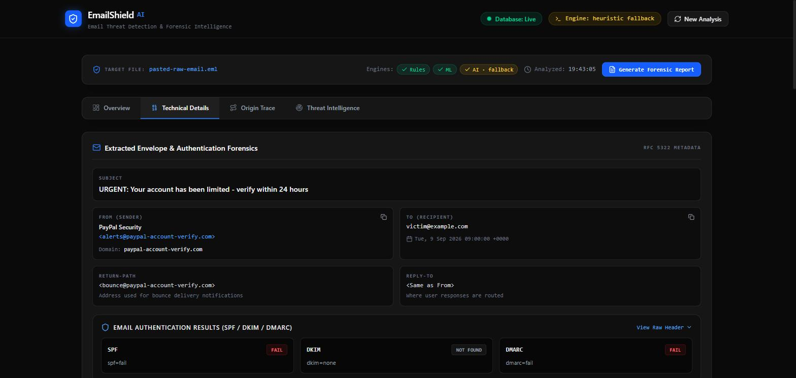
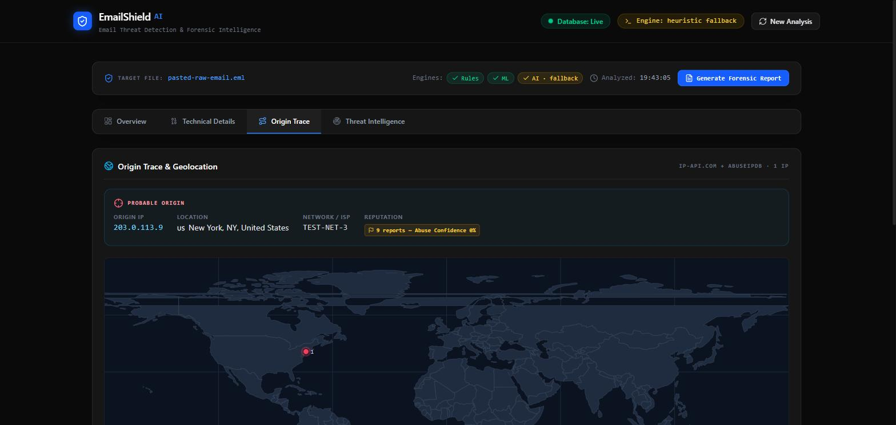
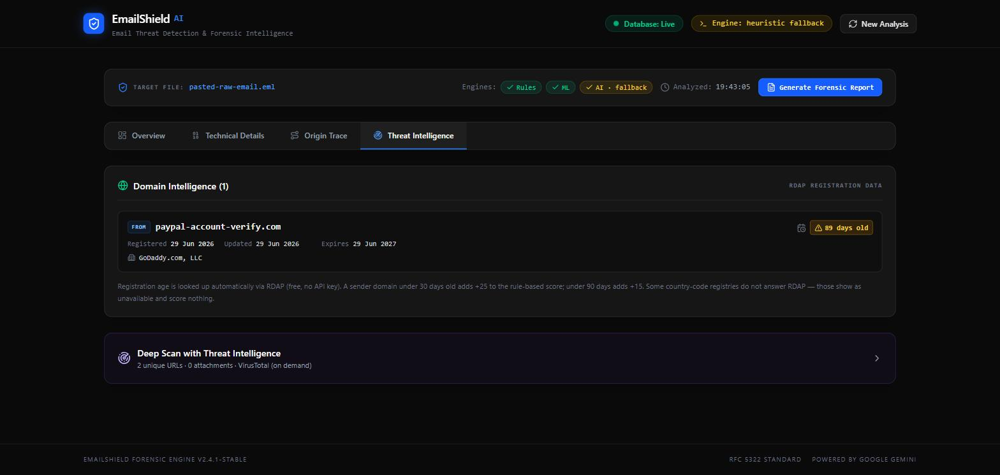

# EmailShield AI

**Local, privacy-first email fraud & phishing forensics.** Upload an email — or connect a live mailbox — and get a plain-English verdict backed by three independent detection engines, live threat intelligence, and a routing-path map, all running on your own machine.



## Why

Phishing and email-based fraud keep rising, but the signals that expose a forged email (SPF/DKIM/DMARC results, a spoofed routing chain, a domain registered three days ago) are buried in technical metadata that ordinary users can't read. EmailShield AI reads that metadata for you, cross-checks it against multiple independent detectors so no single blind spot fools it, and explains the verdict in plain language — then gives you a one-click path to filing a complaint if it's a scam.

## What it does

Given an email, EmailShield AI:

1. Parses the full MIME structure — headers, SPF/DKIM/DMARC, the `Received` relay chain, body, links, and attachments.
2. Scores it with **three independent engines** — a deterministic rule engine, a local pretrained ML classifier, and Gemini AI — blended into one Fraud Score (0–100).
3. Enriches the result with **threat intelligence**: IP reputation (AbuseIPDB), domain registration age (RDAP), geolocation of every mail hop, and on-demand URL/file reputation (VirusTotal).
4. Presents it all in a **tabbed dashboard** that leads with a jargon-free "what does this mean?" summary, and exports a full forensic PDF report.

| Phishing sample | Legitimate sample |
|---|---|
|  |  |

## The three detection engines

| Engine | What it is |
|---|---|
| **Rule engine** | ~13 deterministic, explainable rules — SPF/DKIM/DMARC failures, brand-lookalike domains, urgency language, link/display-text mismatches, forged routing chains, newly-registered domains, and more. Every point is traceable to a named signal. |
| **ML model** | A pretrained, open-source BERT-large transformer (~336M params) fine-tuned for phishing/benign classification (97.17% accuracy on its validation set), served locally via a small Python FastAPI microservice — no email content leaves the machine for this engine. |
| **Gemini AI** | Reads the full parsed email (headers + body + routing) and returns a structured verdict, red flags, and the plain-English summary. Walks a model fallback chain so a quota limit on one model doesn't take down the analysis. |

```
if ML engine is reachable:
    fraudScore = round(ruleScore × 0.35 + mlScore × 0.30 + geminiScore × 0.35)
else:
    fraudScore = round(ruleScore × 0.50 + geminiScore × 0.50)   # ML layer skipped gracefully
```



## Dashboard

A tabbed results view — Overview (plain-English summary + cybercrime-reporting shortcut), Technical Details, Origin Trace, Threat Intelligence, and Attachments (when present).

| Technical Details | Origin Trace (world map) | Threat Intelligence (RDAP) |
|---|---|---|
|  |  |  |

## Five ways to bring an email in

- **Upload a `.eml` file** or **paste raw email source**
- **Sign in with Google** — read-only Gmail OAuth, triage your inbox, run a full scan on demand
- **Connect via IMAP** — a second login path for Yahoo, iCloud, GMX, Zoho, and custom/college mail servers (Outlook/Microsoft 365 isn't supported over IMAP — Microsoft has permanently disabled password-based IMAP login)
- **Chrome extension** — a button injected into Gmail's own UI for an instant in-page quick scan

All five paths funnel into the exact same shared analysis pipeline — no detection logic is duplicated.

## Repository layout

```
emailshield-ai/     React 19 + Vite frontend, Express/TypeScript backend, ml_service/ (Python FastAPI)
extension/          Chrome Manifest V3 extension (Gmail Quick Scan)
```

## Running it locally

**1. Main app** (frontend + backend, port 3000):
```
cd emailshield-ai
npm install
npm run dev
```
Requires a `GEMINI_API_KEY` in `emailshield-ai/.env` (see `.env.example`).

**2. ML microservice** (port 8000, optional — the app degrades gracefully without it):
```
cd emailshield-ai/ml_service
pip install -r requirements.txt
uvicorn main:app --port 8000
```

**3. Chrome extension** (optional):
Load `extension/` as an unpacked extension via `chrome://extensions` → Developer mode → "Load unpacked".

See `emailshield-ai/README.md` for full setup details and environment variables.
